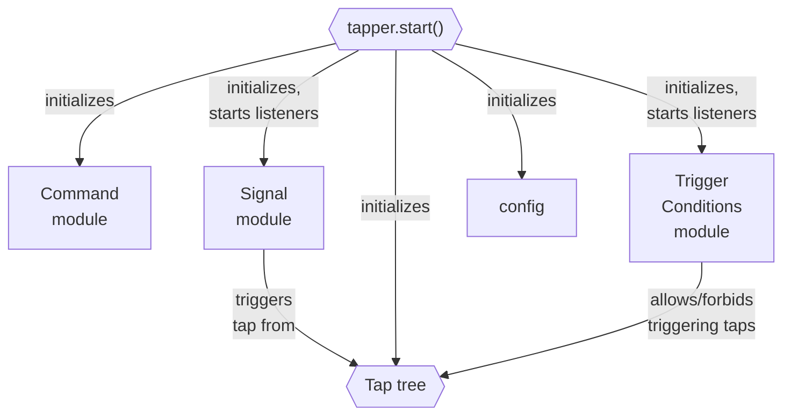
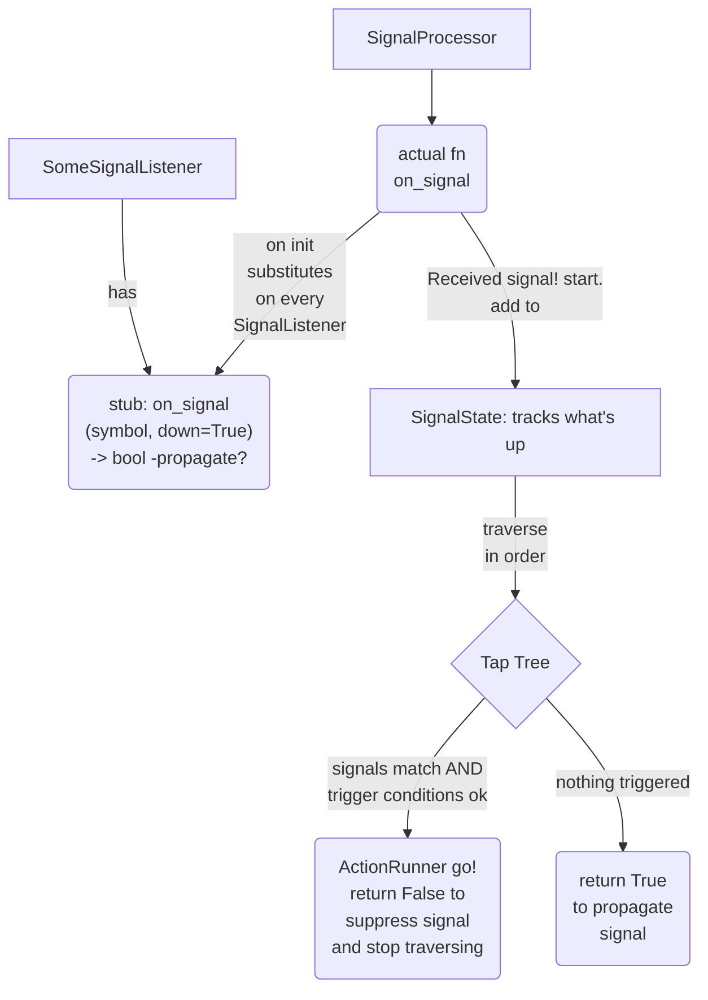
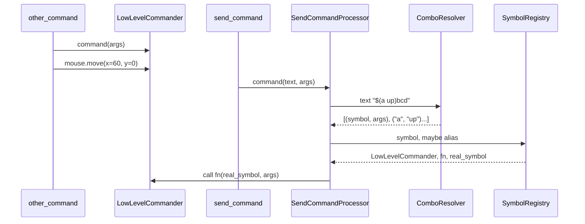

# High level Tapper overview - developer edition

This document is to facilitate the understanding of the project for contributing or forking.

If you're not familiar with user's edition - read that first.

---

In Tapper, the user configures a "Tap Tree" - structure of Taps, in which they may be grouped
into a hierarchy; then calls .start(), which initializes everything and starts the listeners.

Every TAP (trigger-action plan) has:
- trigger (e.g. keyboard press "a")
- standardized trigger conditions (e.g. work only if active window exec name = "chrome.exe")
- action (user-supplied function; tapper provides command functions for OS aspects -
    keyboard and mouse, windows, etc)

#### There are three corresponding parts of the application:

Signal - listens for signals that may trigger a Tap. If a Tap is triggered, the signal is
suppressed, otherwise propagated as normal.

Trigger Conditions - listens for changes in state(such as foreground window), and forbids
triggering a Tap if conditions aren't met.

Command - provides functions to transmit commands to OS, such as pressing keys,
moving the mouse, switching windows. One special case is "send" command, which is versatile
and the processing is complex.

### Signal

### Trigger conditions

TBD, planned after first release (see plans.md)

### Command

